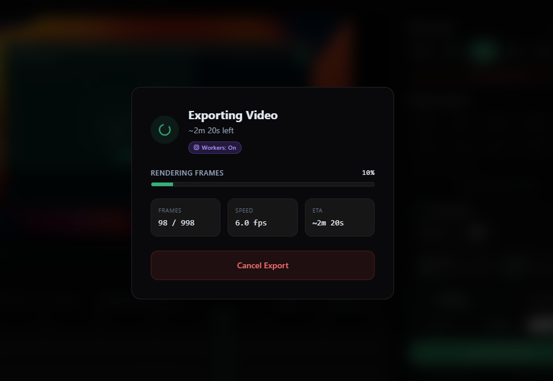
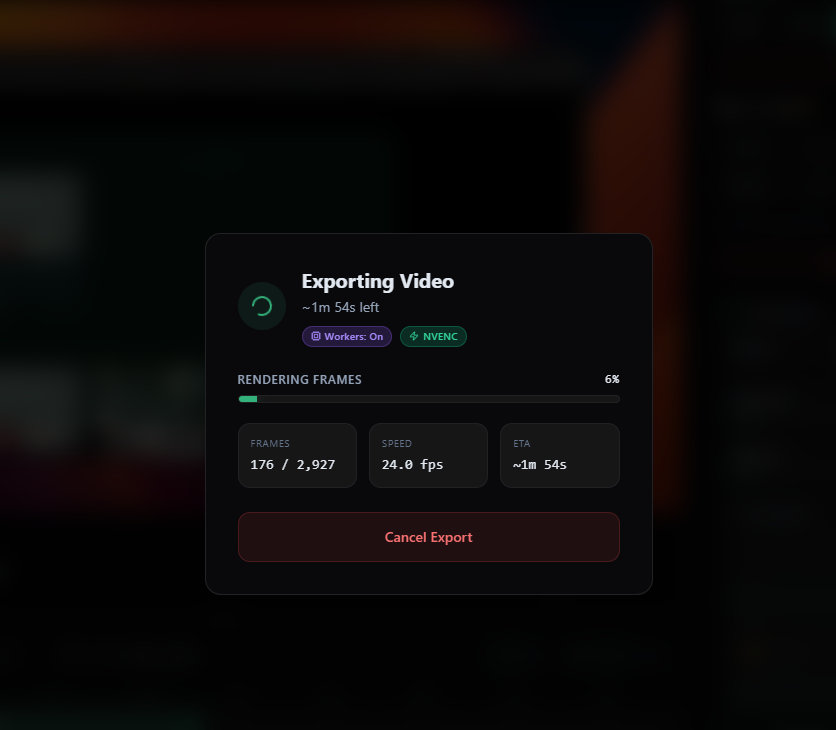

# Cinder

**A fast, hardware-accelerated screen recorder and editor for Windows (and beyond).**

Cinder is a fork of [OpenScreen](https://github.com/openscreenapp/Openscreen) focused on
making the export pipeline genuinely fast on real Windows laptops — by talking to your
GPU's video encoder directly instead of going through a JavaScript-side encoder.

> [!WARNING]
> Early days. The recording / editor UX inherits from upstream OpenScreen and is solid;
> the export pipeline is new and where most of the work lives. Treat as a preview.

---

## Why Cinder

Most Electron-based screen recorders software-encode their MP4 in JavaScript, which is
slow. Cinder hands rendered frames to the **system ffmpeg with hardware-encoder
selection** (NVENC on NVIDIA, QSV on Intel, AMF on AMD, libx264 as fallback), and runs
the rendering on a pool of OffscreenCanvas workers in parallel.

|                       | Before (upstream encode path) | After (Cinder)         |
| --------------------- | ----------------------------- | ---------------------- |
| Export speed (1080p)  | ~6 fps                        | ~25–40 fps peak        |
| Encoder              | WebCodecs software             | NVENC / QSV / AMF / x264 |
| Render parallelism   | Single-thread                  | OffscreenCanvas pool   |
| Renderer ↔ main hop  | ipcRenderer.invoke per frame   | MessagePort, transferable |

<p align="center">
  
  &nbsp;&nbsp;
  
</p>

The right-hand image is the export dialog showing the **NVENC** badge and the worker
pool active — the user gets visual confirmation that hardware encoding is in use.

---

## What's different from upstream OpenScreen

A short tour of what changed:

- **`electron/ffmpegEncoder.ts`** — main-process module that probes ffmpeg for the best
  available H.264 encoder, spawns it reading raw RGBA on stdin, and writes a temp mp4.
- **`electron/ipc/videoEncoderHandlers.ts`** — IPC surface for `start / writeFrame /
  end / cancel / mux`. Plus a `MessageChannelMain` transport so frame bytes travel
  zero-copy from renderer to main, instead of paying for `ipcRenderer.invoke` per frame.
- **`src/lib/exporter/workerPool.ts`** — pool of N PixiJS workers; producer/consumer
  pipeline with bounded in-flight frames so workers actually run in parallel.
- **`src/lib/exporter/renderWorker.ts`** — adds an "rgba" output mode using Pixi's
  `extract.pixels()` for a `gl.readPixels`-backed fast path that skips the 2D
  composite canvas when no shadow / webcam / cursor / annotations are active.
- **`electron/main.ts`** — forces the discrete GPU on hybrid laptops via Chromium
  switches (`force_high_performance_gpu`, etc.). Optional `CINDER_ANGLE` env var
  lets you pick the ANGLE backend (`d3d11` / `vulkan` / `gl`).
- **`electron/ffmpeg.ts`** — `getFfmpegPath()` first looks under `resources/ffmpeg/<platform>/`
  for a bundled binary, falls back to `ffmpeg-static`. Drop a Gyan.dev "full" Windows
  build in `resources/ffmpeg/win/` to ship a known-good ffmpeg with full HW-encoder
  coverage and explicit license posture.
- **`electron/preload.ts` + `electron/main.ts`** — renderer console mirrors to the
  main-process terminal as `[renderer] …` so you can tail one stream during dev.

---

## Install

> Pre-built installers are not yet shipped. Building from source is below.
> Once releases land they will be on the GitHub Releases page.

### Build from source

Requires Node 20+ and a Windows machine with NVIDIA, Intel, or AMD graphics. (Mac and
Linux work too — encoders are auto-detected per platform.)

```powershell
git clone https://github.com/<your-account>/cinder.git
cd cinder
npm install
npm run dev          # development with hot reload + auto-opened DevTools
npm run build:win    # production .exe installer (needs Windows Developer Mode)
```

### Optional: bundle a custom ffmpeg

The default `ffmpeg-static` works on most machines. For full control (specific version,
explicit license, no surprises across users), drop a full Windows build into
`resources/ffmpeg/win/ffmpeg.exe`. See [resources/ffmpeg/README.md](resources/ffmpeg/README.md)
for sources (Gyan.dev for Windows, evermeet.cx for macOS, BtbN for Linux).

---

## Roadmap

Things that aren't done yet, in rough order:

- [ ] Code signing for Windows (signed installer = no SmartScreen warning)
- [ ] Auto-update via `electron-updater` + GitHub Releases
- [ ] **Auto-zoom**: heuristic + cursor-telemetry driven zoom suggestions
- [ ] In-app **Performance** panel (encoder choice, worker count, GPU info)
- [ ] Per-export performance summary card (`Exported in 1m 23s · 32 fps avg · NVENC`)
- [ ] Pass-through fast path for unedited segments of long recordings
- [ ] Linux AppImage + Mac DMG signed/notarized releases

---

## Credits and license

Cinder is based on [**OpenScreen**](https://github.com/openscreenapp/Openscreen) by
**Siddharth Vaddem**, MIT licensed. Substantial additions by Anderson Victor, also MIT
licensed. Both copyright notices are preserved in [LICENSE](./LICENSE) and an explicit
attribution in [NOTICE.md](./NOTICE.md).

If you ship Cinder or fork it further, please keep that attribution intact — the
original OpenScreen project is excellent work and the foundation everything here builds
on. PRs back to upstream OpenScreen are encouraged where the change makes sense for
their roadmap as well.
